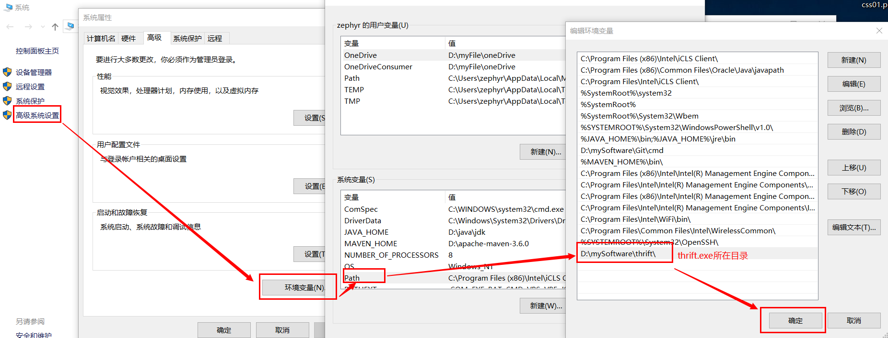
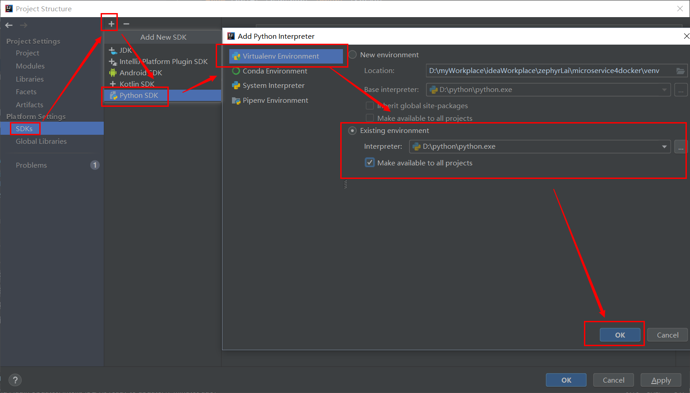

### 一、环境配置
1. thrift安装
    1. win平台
        1. 从apache thrift 官网下载thrift.exe，放置到自定义的文件夹下;
        1. 配置环境变量:   
            
        1. 成功测试
            
1. thrift的python插件安装
    官网下载thrift-0.9.1.tar.gz后解压  
    cd lib/py;
    python setup.py install;
    完成thrift的python插件安装（否则将报错：No module named 'thrift.Thrift'）
1. python的开发配置
    
    